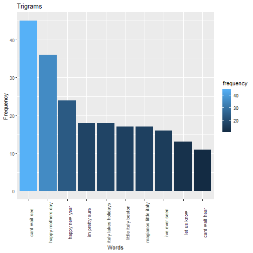

R Studio PPT
========================================================
author: Ashish Kumar Dwivedi
date: 22 July 2020
autosize: true

# Goal of Project

## Load the data first

- Main aim of this project is to perform predictionl by considering huze data for the process of training
- This project is based on the application of NLP where various concepts for example sentiment analysis has been performed

## Load the data 

- Blocks
- News
- Twitter

Slide 2
====================================

# Next Process is sampling

## Removing non-English characters


## Sampling

```
  file.name files.size.MB num.lines num.character num.words
1     blogs      200.4242    899288     206824505  37546239
2      news      196.2775     77259      15639408   2674536
3   twitter      159.3641   2360148     162096031  30093372
```

Slide 3
====================================

# Cleanning and developing

## Cleaning of data has been performed

## Developing of Model has been performed

## Developing N-Grams


```
                                     Word frequency
cant wait see               cant wait see        45
happy mothers day       happy mothers day        36
happy new year             happy new year        24
im pretty sure             im pretty sure        18
italy lakes holidays italy lakes holidays        18
little italy boston   little italy boston        17
```


Slide 4
====================================

# Exploratory Data Analysis

## text data set has been considered for the process of predictions




Slide 5
====================================

# # Obsertvations

## In this study a good amount of text data set has been considered for the process of predictions. 
## Here n-grams contains English stop words
## We have applyied a pre-built R algorithm
## Have developed Shiny app
## It is published at "shinyapps.io" server
